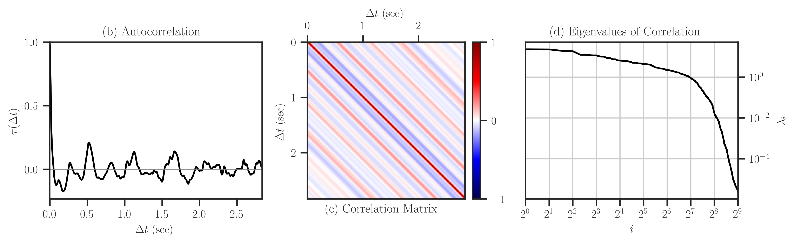

.. _benchmark:

Benchmark Tests
===============

A numerical analysis on the performance of |project| functions is presented in Section 4 of [1]_. Here, we provide supplemental details on how to reproduce the numerical results of that reference.

This notebook plots the results that are produced by |benchmark_py|_ script. The purpose of this script is to compare the presented method versus the conventional method of computing the determinant functions described below.

Determinant Functions
~~~~~~~~~~~~~~~~~~~~~

The following functions are computed:

* **loggdet**: a determinant function used in Gaussian process (hence the name _log-gdet_).

.. math::

    \begin{align}
        \mathrm{loggdet}(\mathbf{A}, \mathbf{X}) :=& \mathrm{logdet}(\mathbf{A}) +  \mathrm{logdet}(\mathbf{X}^{\intercal} \mathbf{A}^{-1} \mathbf{X}) \tag{LD1}\\
        =& \mathrm{logdet}(\mathbf{X}^{\intercal}  \mathbf{X}) + \mathrm{logdet}(\mathbf{N}) \tag{LD2}\\
        =& \mathrm{logdet}(\mathbf{X}^{\intercal}  \mathbf{X}) + \mathrm{logdet}(\mathbf{U}_{\mathcal{X}^{\perp}}^{\intercal} \mathbf{A} \mathbf{U}_{\mathcal{X}^{\perp}}), \tag{LD3}
    \end{align}

where

* :math:`\mathbf{N} = \mathbf{A} + \mathbf{P} - \mathbf{A}\mathbf{P}`
* :math:`\mathbf{P} = \mathbf{I} - \mathbf{X}(\mathbf{X}^{\intercal} \mathbf{X})^{-1} \mathbf{X}`
* :math:`\mathbf{M} = \mathbf{A}^{-1} - \mathbf{A}^{-1} \mathbf{X}(\mathbf{X}^{\intercal} \mathbf{A}^{-1} \mathbf{X})^{-1} \mathbf{X}^{\intercal} \mathbf{A}^{-1}`.
* :math:`\mathbf{U}_{\mathcal{X}^{\perp}}` is the orthonormal basis that is orthogonal to the image of :math:`\mathbf{X}`.

For each of the above functions LD1, LD2, and LD3, we compute (1) the process time and (2) computational FLOPs.

Input Data
~~~~~~~~~~

* Matrix :math:`\mathbf{A}` is randomly generated symmetric and positive-definite (SPD) of the size :math:`n = 2^9`. We *assume* both cases:

    * :math:`\mathbf{A}` is SPD.
    * :math:`\mathbf{A}` is not SPD.

* Matrix :math:`\mathbf{X}` is randomly generated with the size :math:`n \times p`. The ratio :math:`p/n` is varied from :math:`0, \cdots, 1` at :math:`t=50` different ratios, while :math:`n` is fixed. The columns of this matrix are orthogonalized. We *assume* both cases:

    * :math:`\mathbf{X}` is orthogonal.
    * :math:`\mathbf{X}` is not orthogonal.

Instructions to Reproduce Results
---------------------------------

1. Compile |project| package:

   .. prompt:: bash

        ssh orbit
        cd ~/code
        git clone http://www.github.com/ameli/detkit
        cd detkit
        vim detkit/_definitions/definitions.h

   In |definitions|_ file,

   * Set ``PERF_COUNT`` to ``1`` to enable counting FLOPs.
   * Set ``CHUNK_TASKS`` to ``1``.
   * Set ``USE_OPENMP`` to ``0``.

   **Compile the package twice** for each of (1) efficient Gramian matrix multiplication and (2) generic matrix multiplication:

   * To use symmetry in Gramian matrix multiplication, set ``USE_SYMMETRY`` to ``1``.
   * To not use symmetry in Gramian matrix multiplication, set ``USE_SYMMETRY`` to ``0``.

   Then, compile with

    .. prompt bash

        python setup.py install

2. Run a benchmark with :math:`n = 2^9`, repeat the results for :math:`r=10` times, and each time, generate :math:`t = 50` data points in the interval for :math:`p/n = 0, \cdots, 1`.

   .. prompt:: bash

        cd benchmark/jobfiles
        vim jobfile_benchmark.pbs

   In |jobfile_benchmark|_, set ``N=9`` (corresponding to :math:`n = 2^9`), ``NUM_RATIOS=50`` (corresponding to :math:`t=50`), ``REPEAT=10`` (corresponding to :math:`r=10`). Also, set ``FUNC="loggdet"``, which computes :math:`\mathrm{loggdet}(\mathbf{A}, \mathbf{X})`.

   Submit the job with

   .. prompt:: bash

        qsub jobfile_benchmark.pbs

3. The pickle file results should be stored in |pickle_results|_. For the above two experiments, there should be two files with the names:

   +----------------------------------------+--------------------------+---------------+-------------------------------+
   | Output filename                        | function                 | matrix size   | Gramian Matrix Multiplication |
   +========================================+==========================+===============+===============================+
   | ``benchmark_loggdet_9_gram.pickle``    | :math:`\mathrm{loggdet}` | :math:`n=2^9` | with symmetry                 |
   +----------------------------------------+--------------------------+---------------+-------------------------------+
   | ``benchmark_loggdet_9_no-gram.pickle`` | :math:`\mathrm{loggdet}` | :math:`n=2^9` | without symmetry              |
   +----------------------------------------+--------------------------+---------------+-------------------------------+

4. Run this notebook file, which it reads both of the following files:

   +---------------------------------------------------+--------------------+------------------+
   | syntax                                            | Gramian Matrix     | Function         |
   +===================================================+====================+==================+
   | ``base_filename = 'benchmark-loggdet-9-gram'``    | ``USE_SYMMETRY=1`` | ``FUNC=loggdet`` |
   +---------------------------------------------------+--------------------+------------------+
   | ``base_filename = 'benchmark-loggdet-9-no-gram'`` | ``USE_SYMMETRY=0`` | ``FUNC=loggdet`` |
   +---------------------------------------------------+--------------------+------------------+

   For each of the above dataset, these plots are produced:

   * Process time and experimental FLOPs (from count of hardware instructions)
   * logdet values (either logpdet or loggdet). This plot will not be saved.

   and a following plot is produced independent of the pickle files:

   * Analytical FLOPs (from equation for the complexity of each operation)

   The generated plots in the above will be saved in |plots|_.

Notes
-----

 1. The FLOPs are computed using the count of _retired hardware instruction events, using ``perf`` tool API in C++. This library can only use used on **Linux**, and only on **recent processors**.
 2. ``CHUNK_TASKS`` should be set to ``1``. If it is set to ``0``, first, the process times become very oscillatory, and second, the FLOPs per unit matrix-multiplication task (``matmat`` task) becomes a different number. For example, with chunk, the FLOP of ``matmat`` is near 5, and without it, it is 10.
 3. ``USE_OPENMP`` should be set to ``0`` to properly compare both methods of LHS and RHS.
 4. This code only uses one thread of a processor.

Install Package
---------------

First, install |project| by

.. prompt:: bash

    pip install detkit

Datasets
--------

The following numerical results are insensitive to the matrices used during the benchmark tests. However, here we use matrices that are obtained from real applications. The followings describe how to reproduce the datasets described in Appendix C of [1]_.

Figure 

.. image:: _static/images/plots/electrocardiogram.png
    :align: center
    :class: custom-dark

Perform Numerical Tests
-----------------------

The followings show how to reproduce the results of Section 4 of [1]_. First, download the source code of |project| by

.. prompt:: bash

    git clone https://github.com/ameli/detkit.git

The scripts for the benchmark tests are located at |benchmark_folder|_ directory of the source code.

1. Run Locally
~~~~~~~~~~~~~~

* Run |benchmark_py|_ to reproduce results for Toeplitz matrices as follows
  
     .. prompt:: bash
    
         cd /detkit/benchmark/scripts
         python ./benchmark.py
  

2. Run on Cluster with Torque
~~~~~~~~~~~~~~~~~~~~~~~~~~~~~~

* Submit |jobfile_benchmark|_ to reproduce results of log-determinant of simple matrices:
  
     .. prompt:: bash
    
         cd /imate/benchmark/jobfiles
         qsub jobfile_benchmark.pbs

Plot Results
------------

Run |notebook_benchmark|_ to generate plots for computing the log-determinants of Toeplitz matrices. The notebook stores the plots as `svg` and `pdf` files in |plots|_ directory.

.. image:: _static/images/plots/loggdet-9-analytic-flops.svg
    :align: center
    :class: custom-dark
    :width: 63%

.. image:: _static/images/plots/loggdet-9-exp-flops-proc-time.svg
    :align: center
    :class: custom-dark

.. |benchmark_folder| replace:: ``/detkit/benchmark``
.. _benchmark_folder: https://github.com/ameli/detkit/tree/main/benchmark

.. |benchmark_py| replace:: ``/detkit/benchmark/scripts/benchmark.py``
.. _benchmark_py: https://github.com/ameli/detkit/blob/main/benchmark/scripts/benchmark.py

.. |jobfile_benchmark| replace:: ``/detkit/benchmark/jobfiles/jobfile_benchmark.pbs``
.. _jobfile_benchmark: https://github.com/ameli/detkit/blob/main/benchmark/jobfiles/jobfile_benchmark.pbs

.. |pickle_results| replace:: ``/detkit/benchmark/pickle_results``
.. _pickle_results: https://github.com/ameli/detkit/tree/main/benchmark/pickle_results

.. |notebook_benchmark| replace:: ``/detkit/benchmark/notebooks/benchmark_plot_draft_3.ipynb``
.. _notebook_benchmark: https://github.com/ameli/detkit/blob/main/benchmark/notebooks/benchmark_plot_draft_3.ipynb

.. |plots| replace:: ``/imate/benchmark/plots/``
.. _plots: https://github.com/ameli/imate/blob/main/benchmark/plots

.. |definitions| replace:: ``/detkit/detkit/_definitions/definitions.h``
.. _definitions: https://github.com/ameli/detkit/blob/main/detkit/_definitions/definitions.h

References
----------
   
.. [1] Ameli, S., and Shadden. S. C. (2022). *A Singular Woodbury and Pseudo-Determinant Matrix Identities and Application to Gaussian Process Regression* |ameli-woodbury| |btn-bib-1| |btn-view-pdf-1|
   
   .. raw:: html

        

        

        <pre class="language-bib">
        <code class="language-bib">@misc{arxiv.2207.08038,
            doi = {10.48550/arXiv.2207.08038},
            author = {Ameli, S. and Shadden, S. C.}, 
            title = {A Singular Woodbury and Pseudo-Determinant Matrix Identities and Application to Gaussian Process Regression},
            year = {2022}, 
            archivePrefix={arXiv},
            eprint = {2207.08038},
            primaryClass={math.NA},
            howpublished={\emph{arXiv}: 2207.08038 [math.ST]},
        }</code></pre>
        

        

.. [2] Moody GB, Mark RG. The impact of the MIT-BIH Arrhythmia Database.
       IEEE Eng in Med and Biol 20(3):45-50 (May-June 2001).
       (PMID: 11446209); DOI: `10.13026/C2F305
       <https://doi.org/10.13026/C2F305>`__

.. [3] Goldberger AL, Amaral LAN, Glass L, Hausdorff JM, Ivanov PCh, Mark
       RG, Mietus JE, Moody GB, Peng C-K, Stanley HE. PhysioBank,
       PhysioToolkit, and PhysioNet: Components of a New Research Resource
       for Complex Physiologic Signals. Circulation 101(23):e215-e220;
       DOI: `10.1161/01.CIR.101.23.e215
       <https://doi.org/10.1161/01.CIR.101.23.e215>`__

.. |btn-bib-1| raw:: html

    <button class="btn btn-outline-info btn-sm btn-extra-sm" type="button" data-toggle="collapse" data-target="#collapse-bib1">
        BibTeX
    </button>
    
.. |btn-view-pdf-1| raw:: html

    <button class="btn btn-outline-info btn-sm btn-extra-sm" type="button" id="showPDF01">
        PDF
    </button>
    
.. |ameli-woodbury| image:: https://img.shields.io/badge/arXiv-2207.08038-b31b1b.svg
   :target: https://doi.org/10.48550/arXiv.2207.08038
   :alt: arXiv 2207.08038
